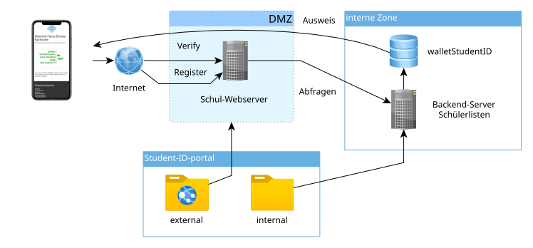

Die Benutzeranleitung finden Sie [hier](USERDOCS.md).

# Installation
Zum Verständnis ist es wichtig, die zweigeteilte Architektur des Systems zu kennen (**interne Zone** mit sensiblen Schülerdaten und **DMZ**, welche die Zugriffe auf das Wallet-System regelt):



## Voraussetzungen
- zwei Webserver mit installiertem PHP-Support (mindestens Version 8.1)
- aktiviertes mod_rewrite auf beiden Servern
- installiertes sqlite3-Paket auf dem internen Server. Andere DBMS sind möglich, derzeit aber nicht unterstützt.
- Systemvoraussetzungen des Fat-free-PHP-Framework, siehe [hier](https://fatfreeframework.com/3.8/system-requirements)

_Es besteht die Möglichkeit, beide Serverteile auch auf einem einzelnen Webserver zu deployen. Dabei muss besonderes Augenmerk auf die Absicherung des internen Teils gelegt werden (z.B. Zugriff und Zugang nur über localhost) und insbesondere sichergestellt werden, dass die Schülerdatei keinesfalls im Zugriffsbereich des Webservers liegt. Diese Vorgehensweise wird hier nicht näher beschrieben, da sie nur gewählt werden sollte, wenn man genau weiß, was man tut (und dann benötigt man hierfür auch keine Anleitung...)_

## Installation auf beiden Webservern
Das Paket sollte auf beiden beteiligten Servern in einem geeigneten Ordner im Webroot heruntergeladen werden:

```shell
cd /var/www/html/ID # Beispiel-Verzeichnis, anpassen!
git clone https://gitlab.hhs.karlsruhe.de/Seyfried/student-id-kortpress.git .
```

Die beiden Ordner ```internal```und ```external``` enthalten die Dateistrukturen für den internen bzw. externen Server. Um möglichst einfache Updates zu ermöglichen, besteht die Möglichkeit, die Dateien über Softlinks zugänglich zu machen:
```shell
ln -s external/* .
```
(und für ```internal``` auf dem internen Server analog). Den Ordner "internal" kann man im Webroot liegen lassen, dieser stellt kein Sicherheitsrisiko dar, solange keine Schülerdaten im Verzeichnis liegen. 

Alternativ kann man die Dateien auch per ```mv``` aus den beiden Unterordnern herausschieben und den jeweils nicht benötigten Ordner löschen. Dabei ist darauf zu achten, dass auf beiden Servern der lib-Ordner mit dem benötigten PHP-Framework vorliegt.

## Konfiguration
### externer Webserver
Die folgende config-sample.php wird für den öffentlichen Webserver mitgeliefert:
```php
<?php
 /* Edit this file and save it as config.php to your external server directory 
    External server configuration
*/

define('school',          'Musterschule Musterstadt');
define('SCHOOL_HOMEPAGE', 'https://www.example.com'); // used in CSP header for theme assets
// set this to TRUE if you want the students to authenticate themselves with their birthday:
define('require_birthday', TRUE);

define('WALLET_USE_APPLE', 1);  // set to 1 to offer the respective pass type
define('WALLET_USE_GOOGLE', 1);

// internal URLs to request
define('internal_server', '<your internal server URL>');

// HMAC secret for birthday verification (use a long random string, e.g. openssl rand -hex 32)
define('BDAY_HMAC_SECRET', '<replace-with-random-secret>');

// set to false on production
define('logging', false);

// no configuration needed below
define('verify_url',      internal_server.'/ID/internal/verify/');
define('register_url',    internal_server.'/ID/internal/register/');
define('lookup_url',      internal_server.'/ID/internal/lookup/');
define('apple_pass_url',  internal_server.'/ID/internal/apple/');

?>
```
Man kopiert diese Datei in ```config.php``` und editiert die entsprechenden ```defines```.

### interner Webserver
Die [config-sample.php](config-sample.php) wird für den internen Webservice mitgeliefert. Wichtige Zeilen, die man anpassen muss, sind ```STUDENTS_CSV``` (Datei, in welcher die Schülerdaten aus dem ASV-Export zu finden sind) und die ```CSV_...``` Zeilen, die angeben, in welchen Spalten der Schüler-CSV-Datei die entsprechenden Daten stehen. Hier sind exemplarisch die wichtigsten Zeilen der Datei:
```php
<?php
  /* Edit this file and save it as config.php to your internal server directory */
  /* local configuration */
  define('STUDENTS_CSV', '/path/to/your/student-csv.csv');
  define('WALLET_API_BASE', 'https://verwaltung-wallet.hhs.karlsruhe.de/v1');
  define('WALLET_API_KEY', '<your-tenant-API-key>');
  define('WALLET_THEME_ID', '<your-theme-uuid>');
  define('WALLET_USE_APPLE', 1);  // set to 1 to offer the respective pass type
  define('WALLET_USE_GOOGLE', 1);

  define('SCHOOL', 'Musterschule Musterstadt');
  define('SCHOOLYEAR_START', 9); // last month of validity
  define('IMG_BASE_URL', 'https://www.example.com/ID/templates/');
  define('SCHOOL_URL', 'https://www.example.com/');

  // CSV structure. Specify the positions of the relevant fields here.
  // Example: we have
  // login;shortname;idnumber;lastname;firstname;email;Klasse;birthday;Austrittsdatum;Eintrittsdatum
  //
  define('CSV_ID', 2);
  define('CSV_LOGIN', 0);  // unique login identifier used to identify passes in backend
  define('CSV_LAST', 3);
  define('CSV_FIRST', 4);
  define('CSV_CLASS', 6);
  define('CSV_BIRTHDAY', 7);
  define('CSV_EXITD', 8);

  // Email-to-ID lookup (GET /ID/@email) — uses STUDENTS_CSV and CSV_ID defined above
  define('CSV_EMAIL_COL', 5);  // column index of email address in the student CSV

  ?>
```
Das Vorgehen ist hier das gleiche wie beim externen Webserver: ```cp config-sample.php config.php``` und editieren der erforderlichen Felder. 