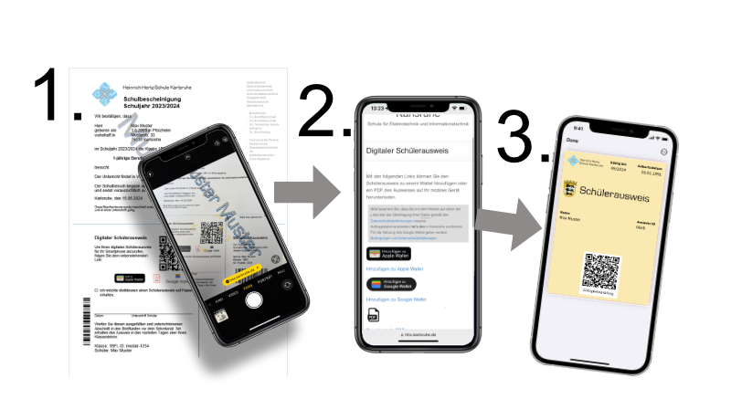
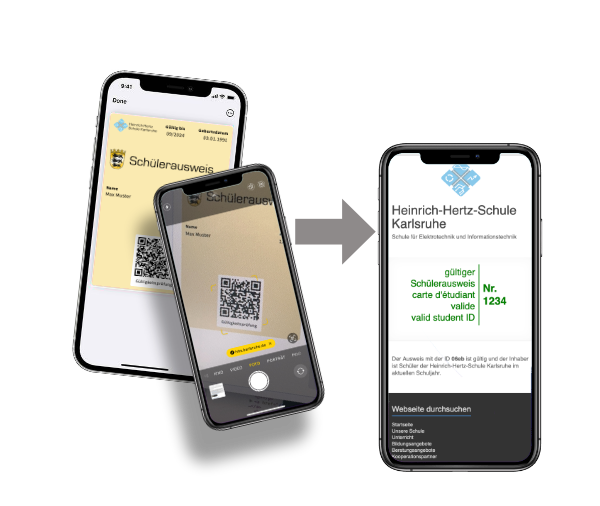
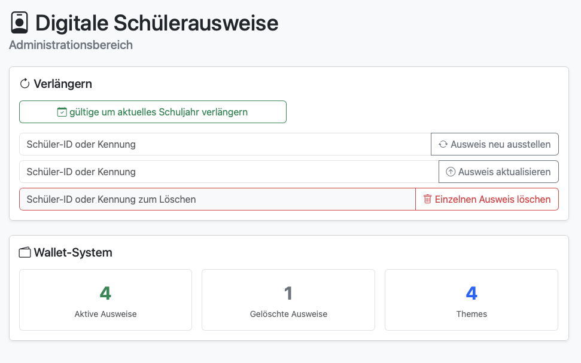

## Erstellung der Registrierungs-Links
Die Registrierung erfolgt über einen Serienbrief (z.B. mit der Schulbescheinigung für das aktuelle Schuljahr), wo die Registierungs-URL als QR-Code ausgegeben ist:



Alle Schülerinnen und Schüler der Schule können sich über einen Link der Form ```https://www.example.com/ID/r/12345678-12345678-1234-12345678-1234``` einen digitalen Schülerausweis erstellen und auf ihr mobiles Endgerät herunterladen. Die Zeichenfolge 12345678-12345678-1234-12345678-1234 am Ende der URL ist die Schüler-ID aus dem Schulverwaltungsprogramm, die automatisch angelegt wird. Hier sind keine weiteren Vorbereitungen erforderlich, außer dem Export der Schülerliste aus dem Schulverwaltungsprogramm. 

Ein Beispiel-Exportformat für ASV finden Sie hier: [Export_Schuelerausweise.exf](Export_Schuelerausweise.exf)

Der Serienbrief kann mit der Word-Feldfunktion 

```{DISPLAYBARCODE "https://www.example.com/r/{MERGEFIELD UUID}" QR \q l}``` 

automatisch einen QR-Code erstellen. Die beiden gescheiften Klammerpaare müssen über ```CTRL+F9``` erzeugt werden. Das Feld ```UUID``` muss in der Datenquelle des Serienbriefs angelegt sein. Der Parameter ```\q l``` setzt die Redundanz im QR-Code auf niedrig (low), was einen kompakteren Code erzeugt.

Eine Gültigkeitsprüfung erfolgt ausschließlich über die Schulseite, es erfolgen keine weiteren Datenübertragungen. 



## Admin-Panel
Auf dem internen Server ist unter ```admin/``` ein Administrationsbereich verfügbar, in dem man unter anderem den Schuljahreswechsel durchführen kann. Alle SuS, die in der CSV-Datei vorhanden sind, erhalten einen Ausweis, der für das Folge-Schuljahr gültig ist.

